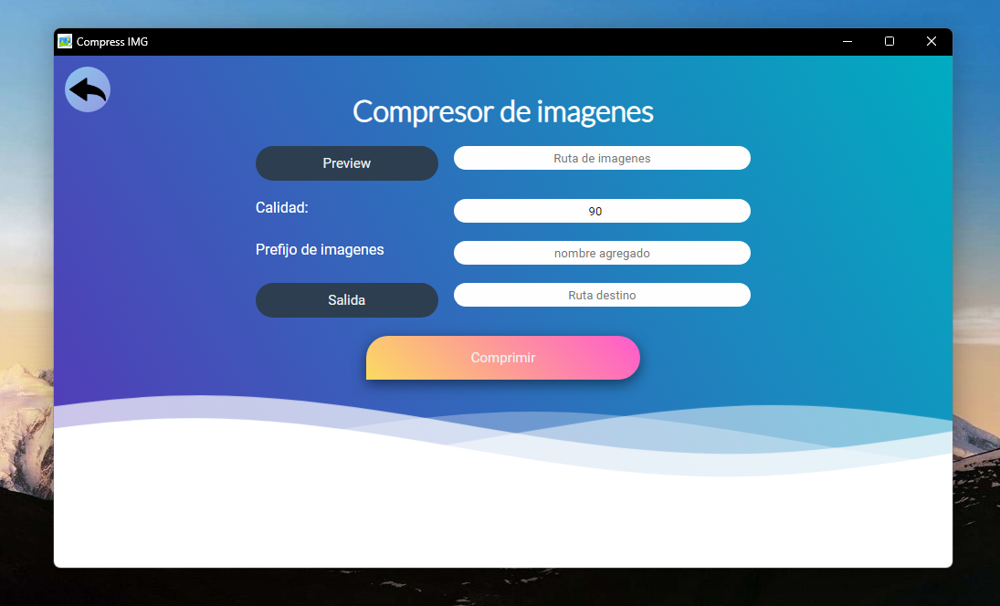

<h1 align="center">Compressor</h1>

This program is a simple image compressor and converter, programmed in python with an interface with WEB technologies.

# Why ?

To practice the python language, write an image compressor and converter. But I also wanted it to have a graphical environment so when looking for options I found the :link:[Eel](https://github.com/python-eel/Eel) module that seemed the best option to the others because for very small and simple python programs you can get a nicer and simpler graphical interface to write by be css html javascript.

# Preview proyect



# Steps to run the program.

The first thing is to create our virtual python environment with the [virtualenv](https://virtualenv.pypa.io/en/latest/index.html) library, it must first be installed as specified in its documentation.

```sh
pip install virtualenv
```

Once installed we must create the virtual development environment, for this case we will call the virtual environment **env** but you can rename it to whatever you need.

```sh
python -m venv env
```

The next thing is to raise the virtual environment or enter it. For this, Windows and Linux have different methods as shown:

> # Windows
>
> ```sh
> .\env\Scripts\activate
> ```

> # Linux
>
> ```sh
> source env/bin/activate
> ```

> # Note
>
> To turn off the virtual environment, just run:
>
> ```sh
> deactivate
> ```

Once inside the virtual environment we must install all the dependencies specified in the **requirements.txt** file. Running the following command:

```sh
pip install -r requirements.txt
```

To finish once all the modules are installed we can proceed to run the program, this is done by executing the main script of the code.

```sh
python Imagen tools.py
```

> # Note
>
> The program can be easily compiled with :link:[pyinstaller](https://pyinstaller.org/en/stable/).

# Technologies

- Python
- JavaScript
- CSS
- SASS
- HTML
